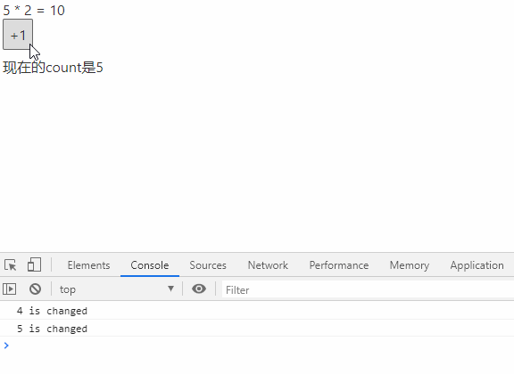

# Svelte学习笔记

### 1. 项目开始

通过npx拉取项目模板然后开始svelte之旅吧~

~~~bash
npx degit sveltejs/template my-svelte-project
cd my-svelte-project
npm install
npm run dev
~~~

### 2. 什么是Svelte

以下两段话我觉得很重要，反应了svelte的思想，引用一段官方的话

> Svelte is a tool for building fast web applications.
>
> It is similar to JavaScript frameworks such as React and Vue, which share a goal of making it easy to build slick interactive user interfaces.
>
> 类似于React和Vue的JavaScript框架，用于快速的构建灵活的用户交互。
>
> But there's a crucial difference: Svelte converts your app into ideal JavaScript at *build time*, rather than interpreting your application code at *run time*. This means you don't pay the performance cost of the framework's abstractions, and you don't incur a penalty when your app first loads.
>
> Svelte和其他框架最大的不同点：**将app在build时就将其 转换为想要的JavaScript代码，而不是在运行时**，意味着你们不需要去关注框架在抽象意义上的性能，以至于在首次加载时不需要去关注性能问题。
>
> You can build your entire app with Svelte, or you can add it incrementally to an existing codebase. You can also ship components as standalone packages that work anywhere, without the overhead of a dependency on a conventional framework.

如何编写一个svelte组件：

> In Svelte, an application is composed from one or more *components*. A component is a reusable self-contained block of code that encapsulates HTML, CSS and JavaScript that belong together, written into a `.svelte` file. The 'hello world' example in the code editor is a simple component.
>
> 在Svelte组件中，每一个组件是由一个HTML，CSS和JavaScript块包裹而成的独立模块，并写入.svelte文件中

### 3. 第一个Svelte组件

+ 代码

~~~javascript
// main.js
import App from './App.svelte';

const app = new App({
	target: document.body,
});

export default app;
~~~

~~~svelte
// App.svelte

hello {name.toUpperCase()}

~~~

+ 实现效果

上面这个例子表明几点：

1. App组件通过import导入到页面中，通过target传递需要对应挂载到的节点上
2. 在.svelte中每个子组件中在script,style标签中分别编写js和css代码
3. 在模板html中可以通过单大括号{}来动态绑定数据，且在{}中可以执行js逻辑

### 4.  组件导入

和vue和react一样，在script标签中通过import来引入想要引入的.svelte组件

这里就简单看一个例子就好

~~~svelte
// Header.svelte

<h1>{text}</h1>

~~~

利用import进行引入

~~~svelte
// App.svelte

<Header />

hello {name.toUpperCase()}

~~~

+ 实现效果

### 5. 插入html字符串

在react中，如果我们想动态的插入html字符串我们需要使用dangerouslySetInnerHTML={__html: "xxxxxxx"}来实现，在svelte中我们只需要通过**@html**这个语法糖来进行插入即可

这里需要注意的是：

**·通过@html插入的class不会被svelte哈希**，因此如果我们需要对插入的元素在style中进行样式的修改需要添加**:global**

~~~svelte
// App.svelte

hello {name.toUpperCase()}

	{@html html}

~~~

+ 效果和渲染元素的dom结构

**关键点：**从上面的dom结构中可见由于在style中添加的css选择器都会被自动哈希化，因此，如果想对插入的html字符串的样式进行修改需要通过:global去哈希

### 6.  事件绑定

和vue有点类似通过在标签上添加on:eventName来绑定对应的回调函数事件，然后绑定在script标签定义的回调函数即可

~~~svelte

<!--事件响应---> 

{count}

<button on:click={handleClick}>点击我+1</button>
~~~

### 7. 声明(计算属性)

在官方文档中把$定义的变量叫做，声明(declaration)，但是我觉得用来说他是计算属性更好一些，类似vue，或者是class中的get方法，react中useMemo定义的变量，其原因是**我们通过$定义一个根据依赖值的变化而变化的动态参数**

1. 一个简单的两倍值的例子

~~~svelte

{count} * 2 = {doubleCount}

<button on:click={addCount}>+1</button>
~~~

+ 实验效果

这里的$ 在我的理解中完全可以作为count改变时的一个回调函数，可以类比于react中的useEffect + useMemo，为了验证猜想，我们来测试一下

2. 一个回调函数的例子

~~~svelte

{count} * 2 = {doubleCount}

<button on:click={addCount}>+1</button>

{ callbackForCount() }

~~~

+ 实验效果

+ 文档是这么说的

> We're not limited to declaring reactive *values* — we can also run arbitrary *statements* reactively.
>
> 声明任何响应值的行为都是被允许的，我们可以运行任意响应的状态表达式

比如我们可以声明一个if

~~~svelte
$: if (count >= 10) {
	alert(`count is dangerously high!`);
	count = 9;
}
~~~

这些都是被允许的

### 8. 复杂类型的更新问题

> Because Svelte's reactivity is triggered by assignments, using array methods like `push` and `splice` won't automatically cause updates. For example, clicking the button doesn't do anything.
>
> Svelte 是通过赋值来发起数据响应的，因此对于array中的push和splice等方法来改变数组并不会被监听到，因此不会引起页面的重新渲染。

因此，如果当我们通过对引用类型采取非 = 号的方式进行改值，其并不会使页面重新渲染，例如下面一个例子

~~~svelte

  {people.name} has {numOfFriends} friend{numOfFriends > 1 ? 's' : ''}: {people.friends.join(',')}
  
数学：{people.score.math}

  
语文：{people.score.chinese}

   
  <input type="text" value={newFriend} on:input={handleInput} />
  <button on:click={addFriends}>增加朋友</button>
  <button on:click={changeScore}>改变分数</button>

~~~

+ 效果

我们通过这种方式进行修改参数发现并不会发生变化，其原因是只有**等号赋值 才会导致页面的刷新**

现在我们通过代码中标记为解决方法的代码来解决这个问题

+ 问题解决

+ 总结
  + 在svelte中，利用非=号的方式对引用类型进行修改会导致页面更新监听的失效，例如数组的splice和push方法
  + 解决办法通过*强行等号赋值*,实现页面的强制刷新
  + 第二种方法是通过...表达式对值进行赋值，也能解决这个问题

### 9. 定义组件参数

之前定义了无props的组件，如果想定义一个有props的组件，需要怎么操作呢？

**接受props的定义**：我们需要在组件内部通过**export let 的方式**来定义组件从外部接受的props

**默认值的设置**：直接对定义的props赋值，就会作为组件的默认值

**使用扩展运算符**：如果有多个props，可以通过声明一个props对象然后利用扩展运算符...来简写

+ 来看例子

~~~svelte
<!-- Input.svelte -->

    {label}
    <input type="text" value={value} />

~~~

+ 引用方法

~~~svelte
<!-- Input Component -->
<Input label={'姓名'} value={name} />
~~~

+ 扩展运算符的例子

~~~svelte
<!---Card.svelte--->

  

    

      姓名:
      {name}
    

    

      年龄:
      {age}
    

    

      爱好
      {hobbies.join(',')}
    

  

~~~

导入方法：

~~~svelte

<Card {...cardInfo} />
~~~

+ 实验效果

### 10. 条件渲染

使用**{#if} {:else}{/if}**的方式实现条件渲染：

1. **{#if}{/if}**声明一个条件块

2. 其中的多个条件通过**{:else if}或者{:else}**进行生命和分割

看一个例子：

~~~svelte

    <button on:click={changeScore}>下一次考试</button>  
    {#if score < 60}
        都不及格了还打游戏，回去学习
    {:else if  score >= 60 && score <= 80}
        <!-- else if content here -->
        还有提高空间，可以玩个5分钟
    {:else}
        <!-- else content here -->
        不用学了，可以打游戏去了
    {/if}

~~~

+ 效果

### 11.  列表循环渲染

使用**{#each items as item}{/each}**来实现列表循环渲染，这里的item可以通过解构赋值，拿到item里面的值，例如**{#each items as {name, age}} {/each}**

+ 一个简单的例子

~~~svelte

<table>
<thead>
    <th>姓名</th>
    <th>年龄</th>
    <th>分数</th>
</thead>
<tbody>
{#each people as p}
     <!-- content here -->
     <tr>
        <td>{p.name}</td>
        <td>{p.age}</td>
        <td>{p.math}</td>
      </tr>
{/each}
</tbody>
</table>
~~~

+ 效果

  

+ 需要注意的问题

由于svelte并非利用虚拟dom来判断元素的更新。在each block这种语法中，通过加载和删除最后一个元素来根据列表进行渲染。这样的问题就是，**如果我们对非最后一个元素节点进行增加删除操作，会导致原来节点中的常量并不会被改变，而导致显示异常的问题**。

+ 例子

1. 定义一个渲染单元EachBlockSon

~~~svelte
// EachBlockSon.svelte

姓名{name}: 年龄{age}

~~~

2. 在父组件中进行列表渲染

我们的目标是**点击按钮后第一个同学的信息会被删除**

~~~svelte

<button on:click={deleteItem}>删除第一个元素</button>
{#each people as p}
    <!-- content here -->
    <EachSonBlock a={p} />
{/each}
~~~

+ 效果

发现问题了吗，**每次都是从尾部删除的！！！！**,这样完全违背了我们的想法，为了解决这个问题，官方推荐将便利元素和渲染的元素进行绑定通过 **p(p.id类似的方法)**来实现渲染元素和数据的**强绑定**

+ 例子

~~~svelte
// 表示每次的列表循环渲染数据和p进行绑定
{#each people as p (p)}
    <!-- content here -->
    <EachSonBlock a={p} />
{/each}
~~~

我们只需要在as的元素后面通过()来绑定一个每个item中的一个元素即可

### 12. 异步渲染模块

我们通常会遇到这么一个问题：我们希望在**异步获取请求之后，再相应渲染页面**，svelte中提供了await-block来实现这个过程。当然也可以和vue和react一样，在调用接口后手动设置对应state的值，然后进行条件渲染。只不过svelte提供了这么一个方式，更为方便。

+ 代码例子

~~~svelte

    {#await getRandomNumber()}
        <!-- promise is pending -->
        wait data,loading........
    {:then value}
        <!-- promise was fulfilled -->
        The random number is {value}
    {:catch error}
        <!-- promise was rejected -->
        there are some error
    {/await}

~~~

+ 实现效果

这里的实现效果就是，一开始显示loading的状态，3秒后会显示 生成的随机数

### 13. 表单元素的双向绑定

#### 1. input受控绑定

使用**bind**关键字进行绑定，svelte通过bind关键字来完成类似v-model的双向绑定

+ text

~~~svelte
<input type="text" bind:value={formData.name} />
~~~

+ checkbox

~~~svelte
<input type="checkbox" bind:checked={formData.checkboxVal} />
~~~

+ number

~~~svelte
<input type="number" bind:checked={formData.number} />
~~~

+ range

~~~svelte
<input type="range" bind:checked={formData.rangeVal} />
~~~

+ select

~~~svelte

{#each gender as gen, i}
    

    <input
        type="radio"
        bind:group={radioGender}
        value={gen.value}
        id={`radio-${i}`} 
    />
    <label for={`radio-${i}`}>{gen.label}</label>
    

{/each}

{#each hobbies as hobby, i}
  <input
    type="checkbox"
    bind:group={selectHobby}
    value={hobby}
    id={`checkbox-${i}`} />
  <label for={`checkbox-${i}`}>{hobby}</label>
{/each}
~~~

#### 3. 获得DOM元素

使用**bind:this**来绑定得到对应DOM元素对象，类似于react中的ref

经典例子： input外部控制聚焦

~~~svelte
<input type="text" bind:this={inputRef}>
<button on:click={() =>{inputRef.focus()}}>input聚焦</button>
~~~

#### 4. 自定义元素通过bind实现双向绑定

自定义一个带label的输入框，先

~~~svelte
<!---MyInput.svelte--->

    {label}
    <input type="text" bind:value={fVal}>

~~~

父组件，通过**bind:fVal**来实现父组件的变量和内部input的双向绑定

~~~svelte
<MyInput bind:fVal={myInputVal} label="自定义输入" />
~~~

